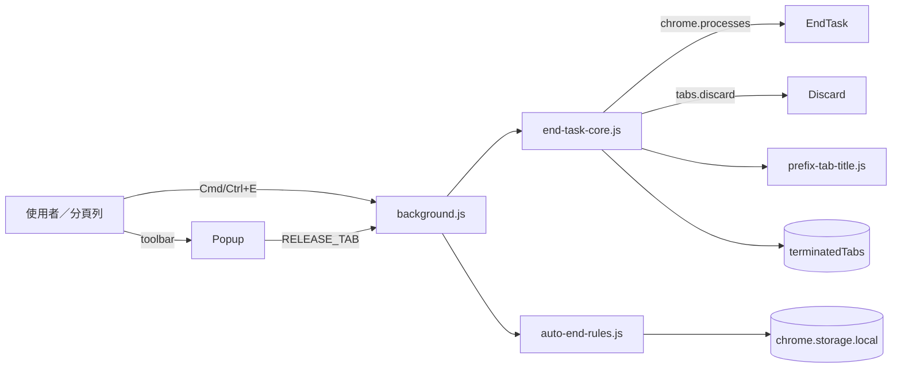

# TabNap

Chromium 系瀏覽器專用。一鍵休眠分頁以釋放記憶體。有 `chrome.processes` 時等同 Task Manager 的 End Task；穩定版則自動改走 `chrome.tabs.discard()`。

**原始碼：** [github.com/davislinyd/TabNap](https://github.com/davislinyd/TabNap)

**目前版本：** 見 `manifest.json`（Semantic Versioning）

**授權：** [MIT License](LICENSE)

## 版本規範

版本來源以 `manifest.json` 的 `version` 為準，遵循 Semantic Versioning：修正、效能調整與小型 UX 變更升 PATCH；新增相容功能升 MINOR；不相容變更升 MAJOR。同一輪交付只升級一次；僅文件或純內部變更可不升版，且交付時需說明原因。未明確要求時不建立封裝或發布產物。

## 架構

資料只留在本機瀏覽器：規則寫入 `chrome.storage.local`，已釋放分頁標記走 `chrome.storage.session`（不支援時退回 local／記憶體）。沒有外部後端。

- [互動式元件架構圖](docs/diagrams/tabnap-architecture.html)：Popup、service worker、EndTaskCore、AutoEndRules、scripting 注入與 Chromium API。
- [互動式釋放／喚醒流程圖](docs/diagrams/tabnap-workflow.html)：手動釋放、自動釋放、terminate／discard 與喚醒。
- [架構圖目錄](docs/README.md)：圖表來源 JSON 與產物說明。



## 功能

### 釋放與喚醒分頁

- **釋放**：卸載選定分頁以釋放記憶體。Dev channel 會終止 process；穩定版則 Discard
- **喚醒**：重新載入已釋放的分頁
- **全部釋放**：一次處理目前視窗中所有可操作分頁（包含作用中分頁）
- **全部喚醒**：一次喚醒目前視窗中所有已釋放的分頁
- **快捷鍵**釋放當前分頁後，狀態會與 popup 同步（可喚醒）

在 **Dev channel** 終止 **http / https / file（本地 HTML）** 分頁前（手動、快捷鍵、**全部釋放**），擴充功能會在 process 仍存活時 best-effort 於 `document.title` 前加上 ♻️，方便在分頁列辨識；**喚醒** 或瀏覽器自動復活後標題會恢復。注入有短逾時，失敗不阻擋釋放。若未授予站點／檔案存取權、或屬保護頁面，則跳過前綴但仍終止 process。**自動釋放**與穩定版 Discard 不會注入 ♻️。

所有釋放方式都會在釋放前 best-effort 將瀏覽器分頁列的 favicon 換成 💤；喚醒後重新載入頁面，網站 favicon 會恢復。若頁面不允許注入，則維持原本的 favicon，不阻擋釋放。

**本地 `file://` 檔案：** 需在 `chrome://extensions`（或 `edge://extensions`）→ 本擴充功能「詳細資料」中開啟 **「允許存取檔案網址」／Allow access to file URLs**，非作用中分頁才能穩定注入標題前綴；對目前作用中分頁，透過點擊工具列圖示開啟 popup 時，`activeTab` 通常已足夠。

**全部釋放部分成功：** 列表會依實際狀態重載；僅在完全無法釋放時才跳出錯誤。已釋放與仍存活的分頁會分開顯示（喚醒 / 釋放）。

**共用 process（僅 Dev End Task）：** Chromium 可能讓多個分頁共用同一個 renderer process。End Task 是 process 級操作（與 Task Manager 相同），因此終止一個分頁時，同 process 的其他分頁也會一併結束。Discard 則是分頁級，不會連坐。

**已釋放狀態：** 釋放後列表會顯示喚醒。Dev End Task 的標記會保留到你按 **喚醒 / 全部喚醒**（或關閉該分頁），不會因為錯誤頁仍有 process 就自動清掉。穩定版 Discard 若你在分頁列點回該頁，下次開啟 popup 會自動改回釋放。

**作用中分頁（僅 Discard）：** 原生 `chrome.tabs.discard()` 不能卸下目前焦點分頁。若目標是作用中分頁，會先切到同窗相鄰的未休眠分頁；若沒有，則開一個預設新分頁再 Discard。切焦點可能關閉 popup，釋放仍由 service worker 完成。

### 自動釋放

- 啟用後，閒置超過指定分鐘數的分頁會自動被釋放
- 可設定預設閒置時間（1–120 分鐘）
- 可為不同的 `domain`、`FQDN` 或 `URL` 設定不同規則
- 站點規則可設定為 **Never Close** 或指定分鐘數後自動釋放
- 可直接在 popup 的分頁列為單一 tab 設定 **預設**、**Never Close** 或 **自訂閒置分鐘**
- 分頁級設定優先於站點規則與全域預設
- 啟用時每分鐘檢查一次；關閉自動釋放後會停止定時 alarm，避免無謂喚醒
- **Never Close**（分頁或站點規則）會略過 **自動釋放** 與 **全部釋放**；單一分頁手動釋放仍可強制執行
- popup 底部 **除錯 Log** 預設收合；展開可檢視全文，並可複製或清除

### 快捷鍵

- **釋放當前分頁**：`Cmd+E`（macOS）/ `Ctrl+E`（Windows、Linux）— 預設
- **開啟擴充功能**：無預設，請至 `chrome://extensions/shortcuts` 或 `edge://extensions/shortcuts` 自行設定（如 `Cmd+Shift+E`，部分瀏覽器可能保留此組合）

### 操作方式

- 點擊工具列圖示開啟 popup，選擇分頁後按「釋放」
- 使用快捷鍵釋放當前分頁
- popup 內可設定自動釋放、預設閒置分鐘數、站點規則，以及單一分頁的 Never Close / 自訂閒置

## 安裝方式

### Chrome / Edge / Brave

1. 前往 `chrome://extensions` 或 `edge://extensions`
2. 開啟「開發人員模式」
3. 點擊「載入未封裝項目」
4. 選擇本專案資料夾

開發版（Chrome Dev / Edge Dev）可使用完整 End Task；穩定版會自動降級為 Discard。

## 相容性

- **Chrome Dev / Edge Dev**：完整 End Task（終止 process）
- **Chrome / Edge 穩定版、Brave**：自動改用 Discard 休眠分頁
- **Chromium（開發版）**：若含 `chrome.processes` API 則走 End Task，否則 Discard

本擴充功能另需 **`scripting`**、**`activeTab`** 與 **`http://*/*`、`https://*/*`、`file:///*` 主機權限**，才能在釋放前修改分頁列 favicon，並在 Dev End Task 前修改分頁標題（僅注入標記，不讀取網頁內容）。本機檔案另需使用者開啟「允許存取檔案網址」。舊版白名單會在首次載入新版時自動遷移成站點規則。

## 自訂快捷鍵

前往 `chrome://extensions/shortcuts`（Chrome）或 `edge://extensions/shortcuts`（Edge）可自訂：

- **Activate the extension**：開啟擴充功能 popup
- **釋放當前分頁**：釋放目前分頁

## 專案結構

```
├── manifest.json                 # 擴充功能設定與版本來源
├── auto-end-rules.js             # 自動釋放規則、遷移與 storage helper
├── end-task-core.js              # terminate／discard／批次／狀態校正
├── debug-log.js                  # popup 除錯 log（可複製）
├── popup.html                    # popup 介面
├── popup.js                      # popup 邏輯
├── popup.css                     # popup 樣式
├── background.js                 # Service Worker（快捷鍵、自動釋放、訊息）
├── prefix-tab-title.js           # 釋放前注入標題標記與睡眠 favicon
├── icons/                        # 擴充功能圖示
├── docs/diagrams/                # 架構與流程圖
├── store/                        # Chrome Web Store 文案與截圖
├── test/                         # 純函式測試
├── test-load/                    # 無 processes API 的載入測試
├── AGENTS.md                     # 專案規則
├── BROCHURE_zh-TW.md             # 產品文宣
├── LICENSE
└── README.md
```

## 隱私

TabNap 不把瀏覽資料送到外部伺服器。分頁 URL、標題、規則與已釋放狀態只存在本機 `chrome.storage`。`scripting` 僅在釋放前注入標記，不讀取頁面內容作追蹤。

## 授權

[MIT License](LICENSE)
